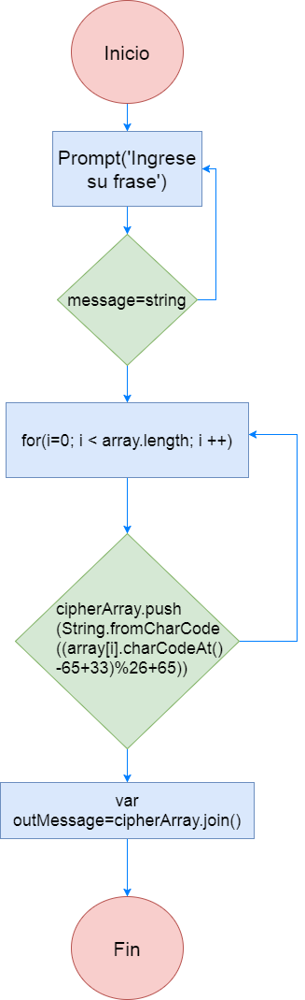

### Pseudocódigo
1. Enviar un prompt al usuario quien introducirá la frase a cifrar
2. Si el usuario no introduce ningún valor o introduce un valor númerico se devolvera un alert de error
3. Si es una frase entonces pasamos a recorrer el arreglo
4. Se declara la función cipher la cual cifrará la frase del usuario
5. Se declaran dos arreglos el primero contendrá la frase del usuario y el otro será la que guarde el nuevo arreglo
conel cifrado realizado
6. Comenzaremos a recorrer el arreglo, con la longitud del primer arreglo
7. Se deberan ir agregando los valores en un nuevo arreglo donde se almacenara la posición que les corresponde del cifrado césar
8. Se aplica la fórmula de cifrado César al arreglo original
9. Los resultados se mostrarán en una nueva variable que será la que permita visualizarlo en pantalla
10. Fin

